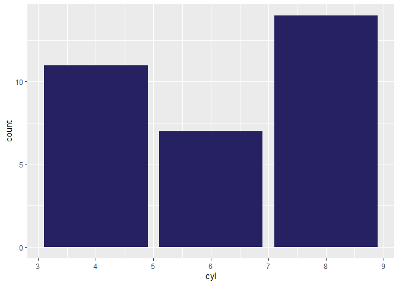
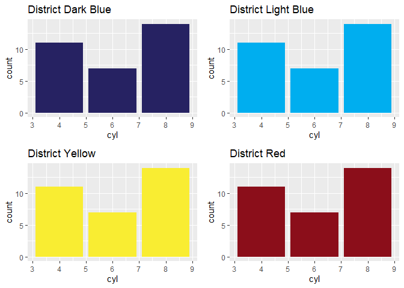
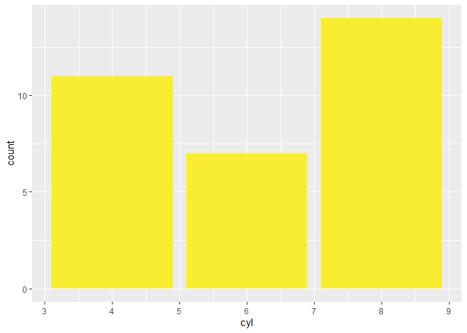

<!-- README.md is generated from README.Rmd. Please edit that file -->

# dreaformat 

<!-- badges: start -->
<!-- badges: end -->

The goal of dreaformat is to make formatting tables and plots according
to district and department standards easier.

## Installation

You can install the development version of dreaformat from
[GitHub](https://github.com/) with:

``` r
# install.packages("devtools")
devtools::install_github("dormezil/dreaformat")
```

## Example of using district color functions

Bar plot in district dark blue

``` r
# Return hex code for district dark blue
library(tidyverse)

library(dreaformat)
district_dark_blue()
#> [1] "#262262"

# Sample of simple bar graph in district dark blue using mtcars package
mtcars %>%
  ggplot(aes(x = cyl)) +
  geom_bar(fill = district_dark_blue())
```



District light blue, district yellow, and district red is available as
well in the following code:  
district_light_blue  
district_yellow  
district_red

### Examples same plot in other colors

#### District light blue



#### District yellow


